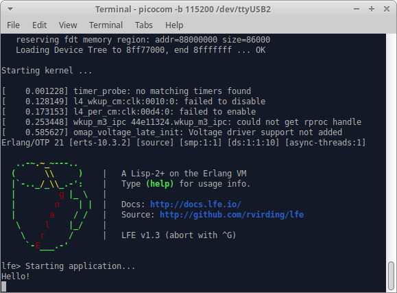

# HelloLfe

This demonstrates a simple Nerves project that's written in
[LFE](http://lfe.io/).



## LFE-izing a Nerves project

Since LFE is a BEAM language, it works great with Nerves. This example project
is a trivial LFE/Nerves project. Since the Nerves tooling uses Elixir, the top
level project must use Elixir's `mix` build tool, but dependencies can use other
build tools like `rebar3`.

The following describes what needed to be done after creating a Nerves project
the "normal" Elixir-based way using `mix nerves.new <project_name>`.

The first step is to add LFE as a dependency in your `mix.exs`:

```elixir
    {:lfe, github: "rvirding/lfe", branch: "develop", compile: "make"},
```

I've found that it's easiest to have `mix` build LFE source files.  The
[mix_lfe](https://github.com/meddle0x53/mix_lfe) was so close to working, but I
had trouble with it (could have been me struggling along the way). To work
around the issue, I copied out the `mix` compiler from it. That's the code in
the `lib` directory. It would be great if someone could work with the `mix_lfe`
maintainer to split the project up so that the compiler piece can be used
separately.

The next step is to update the `rel/vm.args`. First disable `embedded` mode
since it doesn't seem to work with LFE:

```sh
#-mode embedded
```

Then update the `-user` option to start the LFE shell:

```sh
-user lfe_init
```

Finally, create a `src` directory and put your LFE code in there like you
would in a normal LFE project.

## Building

Building follows the standard Nerves recipe. Here's an example:

```sh
export MIX_TARGET=bbb
mix deps.get
mix firmware
```

And then burn an SD card using `mix firmware.burn`.

## Using

The images pull in the standard `nerves_pack` infrastructure for bringing up
networking and other initialization steps. See the `config/config.exs` for
network parameters and other configuration.

## Running

Attach to the console of your board (i.e., RPi3 is HDMI, BBB/RPi0 is USB
gadget). You should see prints from the application. Note that the first boot
takes quite a bit longer than the rest since it initializes the application's
writable filesystem.

To see log messages, run:

```lfe
(Elixir.RingLogger:next)
```

## Notes

It's handy to have a version of LFE on your system that has the same version
used with Nerves. The latest releases [don't
compile](https://github.com/rvirding/lfe/issues/342), so I used the `develop`
branch for this project. Installing the `develop` branch on your host isn't too
bad and `asdf` can do it:

```sh
asdf plugin-add lfe
asdf install lfe ref:develop
asdf global lfe ref:develop
```

The [mix_lfe](https://github.com/meddle0x53/mix_lfe) was so close to working,
but I had trouble with it. To work around the issue, I copied out the `mix`
compiler from it. That's the code in `lib`.
